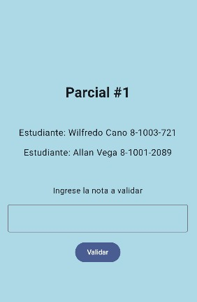
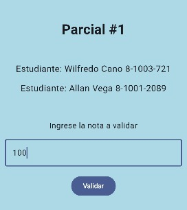
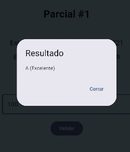

# Parcial #1 - Validación de Notas

Este proyecto es una aplicación desarrollada en **Kotlin con Jetpack Compose**, que permite ingresar una nota y muestra su calificación correspondiente mediante un diálogo. Forma parte del parcial práctico de los estudiantes:

- **Wilfredo Cano 8-1003-721**
- **Allan Vega 8-1001-2089**

## Capturas de Pantalla

### a) Pantalla principal

---

### b) Ingreso de nota

---

### c) Resultado en diálogo

